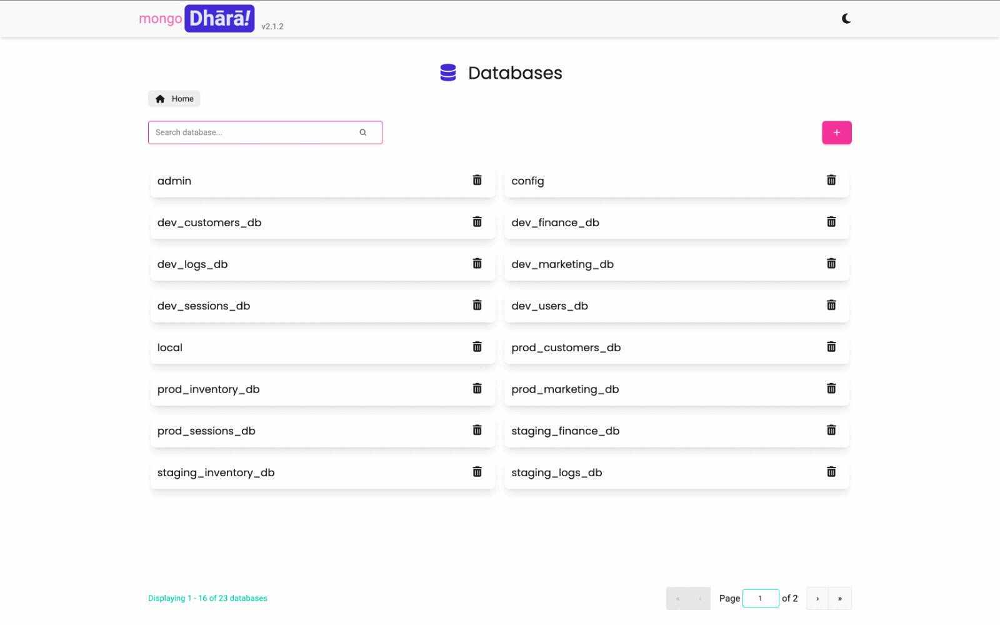

---

[](https://opensource.org/licenses/MIT)
[](https://www.python.org/downloads/)
[](https://nodejs.org/)
[](https://fastapi.tiangolo.com/)
[](https://svelte.dev/)
[](https://www.mongodb.com/)
[](https://www.docker.com/)
[](https://kubernetes.io/)

---

_MongoDB management made elegant, fast, and intuitive._

**MongoDhārā** is a blazing-fast web UI for MongoDB — built with Svelte & FastAPI.  
Manage databases, collections, documents, and GridFS visually with zero overhead.

---



---

## 📖 Table of Contents

- [✨ Key Features](#-key-features)
- [🚀 Quick Start](#-quick-start)
- [📦 Helm Chart Deployment](#-helm-chart-deployment)
- [🐳 Docker Setup](#-docker-setup)
- [🧑‍💻 Local Development](#-local-development)
- [📁 Project Structure](#-project-structure)
- [🔧 Environment Variables](#-environment-variables)
- [🤝 Contributing](#-contributing)
- [⚖️ Legal Notice](#️-legal-notice)
- [📄 License](#-license)

---

## 💡 Why MongoDhārā?

- Near-raw MongoDB performance with minimal overhead
- Clean, modern UI for effortless data exploration
- Full control: databases, collections, documents, GridFS, and bulk operations
- Scalable deployment with Kubernetes and Helm support
- Open-source and developer-friendly

---

## ✨ Key Features

### ⚡ High-Performance UI
- PyMongo-powered queries with fast pagination and filtering
- Responsive design with light/dark mode
- Real-time updates and notifications
- Intuitive navigation with breadcrumbs and global search

### 🗂️ Database & Document Management
- Create, rename, and delete databases/collections
- Browse, query, and edit documents with a rich JSON editor
- Advanced filtering, sorting, and aggregation
- Bulk import/export and large-scale operations
- MongoDB-compliant naming and validation

### 📁 GridFS File Storage
- Upload, download, and manage files with GridFS
- Multiple storage buckets
- Metadata search

### 🧾 Rich JSON Editing
- Syntax highlighting, auto-format, and real-time validation
- Inline error detection and schema assistance

---

## 🚀 Quick Start


For **local development**:

```bash
# Backend
cd backend
python -m venv venv
source venv/bin/activate
pip install -r requirements.txt
uvicorn main:app --reload --host 0.0.0.0 --port 8000

# Frontend
cd frontend
npm install
npm run dev
```

Access frontend at [http://localhost:5173/mdhara](http://localhost:5173/mdhara).

---

## 🐳 Docker Setup

```bash
# Backend
docker build -t mongodhara/backend:latest ./backend
docker run -p 8000:8000 mongodhara/backend:latest

# Frontend
docker build -t mongodhara/frontend:latest ./frontend
docker run -p 5173:5173 mongodhara/frontend:latest
```
---
## ☸️ Helm Chart Deployment

Deploy MongoDhārā on a Kubernetes cluster using the included Helm chart.  

For full instructions, configuration options, and advanced deployment examples, please see the dedicated Helm chart README:

[📖 View Helm Chart README](./helm-chart/README.md)

---

## 📁 Project Structure

```plaintext
mongodhara/
├── backend/               # FastAPI backend source code
├── frontend/              # Svelte frontend source code
├── helm-chart/            # Kubernetes Helm chart
├── media/                 # Logo, demo GIFs
├── README.md              # Main README
└── LICENSE                # License
```

---

## 🔧 Environment Variables

| Variable              | Description                       | Default                     |
| --------------------- | --------------------------------- | --------------------------- |
| `MONGO_URI`           | MongoDB connection string         | `mongodb://localhost:27017` |
| `REMOTE_API_BASE_URL` | Backend API base URL for frontend | `http://localhost:8000`     |

---

## 🤝 Contributing

Contributions, issues, and feature requests are welcome!

1. Fork the repository  
2. Create your branch (`git checkout -b feature/your-feature`)  
3. Commit your changes (`git commit -m 'Add some feature'`)  
4. Push to the branch (`git push origin feature/your-feature`)  
5. Open a Pull Request  

---

## ⚖️ Legal Notice

This project is **not affiliated with, endorsed by, or sponsored by MongoDB, Inc.**  
**MongoDB®** is a registered trademark of **MongoDB, Inc.**  

---

## 📄 License

This project is licensed under the **MIT License** — see the [LICENSE](LICENSE) file for details.

---

Made with ❤️ by the [Soumya Sen](https://github.com/sensoumya)
